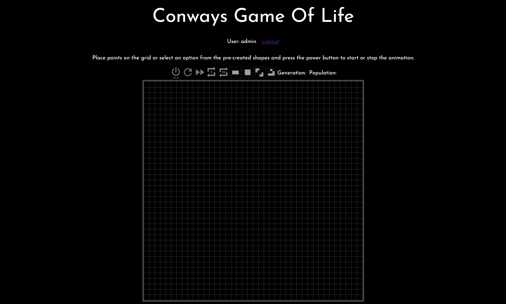

# Conways-Game-Of-Life
Recreation of Conways game of life with login/sign up using JavaScript, PHP, HTML, CSS, and SQL

The game begins on the login page with a leaderboard and sign up option made using a PHP script to retrieve/update information from
an SQL database.

Upon successful registration, a user is redirected to the game which features multiple animation options, generation counter and 
a population counter. The interactive board is created as an HTML table manipulated with Javascript to make it clickable. A 2D array keeps track of active, or alive,
cells and implements the game rule on each run of the game. 

The rules:\
Any live cell with two or three live neighbours survives.\
Any dead cell with three live neighbours becomes a live cell.\
All other live cells die in the next generation. Similarly, all other dead cells stay dead\

